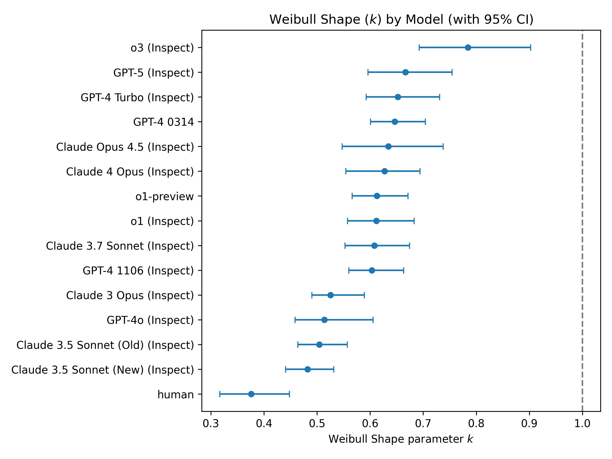
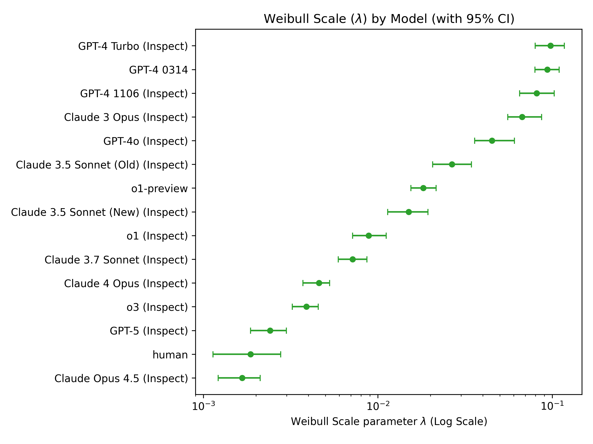
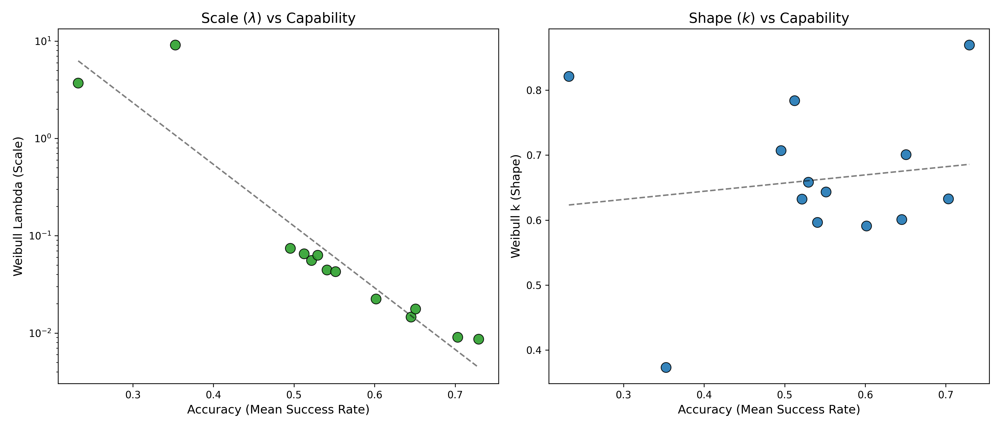
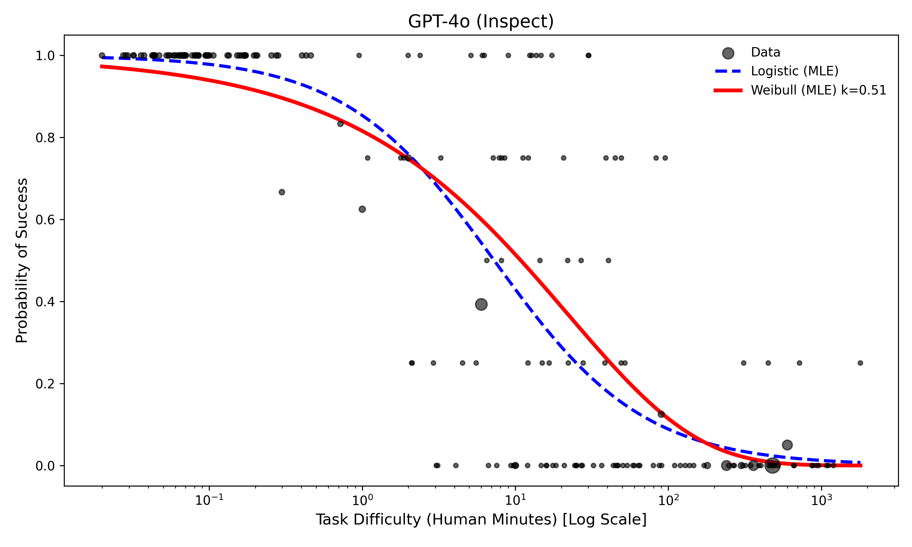
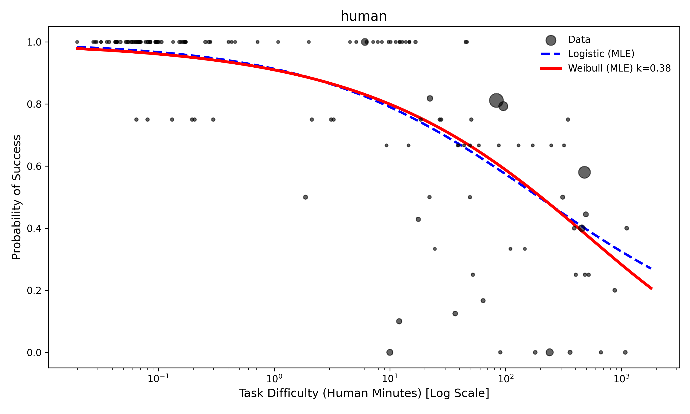
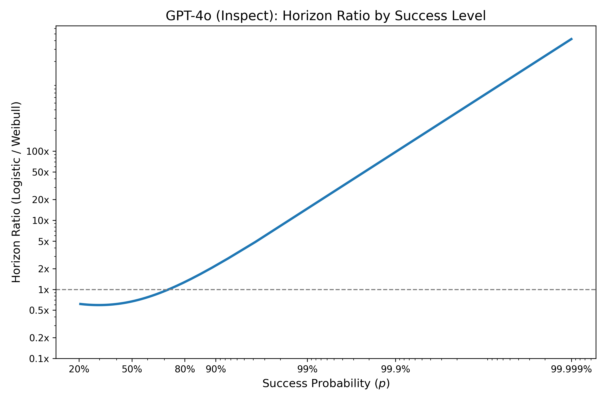
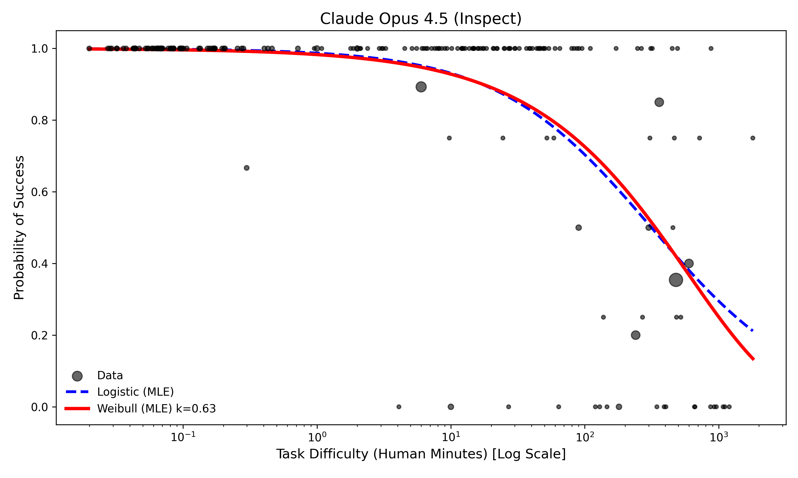

# Peto's Paradox and AI Agent Reliability

> **Companion repository** to the blog post: [Peto's Paradox and the Future of AI Agents](https://gushamilton.github.io/lab/2026/01/23/petos-paradox-ai-agents/)

This repository contains all code and data for analyzing METR's agentic task data using survival analysis methods. We compare logistic and Weibull models to understand how AI agent failure rates behave over time.

---

## Feb 26, 2026 Update (Latest Public METR Data)

**New outputs live here:**
- `results_mle/feb26/`
- `figures/feb26/`

**Quick summary**
- **Human remains the lowest κ (kappa)**: κ ≈ 0.376 (still the strongest decreasing-hazard pattern).
- **Model size vs κ is still weak**: κ varies only modestly with accuracy (capability), while λ drops sharply with accuracy.
- **Logistic vs Weibull**: Logistic wins on BIC for **9** models, Weibull wins for **6**. Tails still diverge meaningfully.

**New figures (Feb 26)**
- Figure 1: κ by model — `figures/feb26/Figure1.png`
- Figure 2: λ by model — `figures/feb26/Figure2.png`
- Figure 3: κ & λ vs accuracy — `figures/feb26/Figure3.png`
- Figure 4: GPT‑4o (Inspect) fit — `figures/feb26/Figure4.png`
- Figure 5: Human fit — `figures/feb26/Figure5.png`
- Figure 6: GPT‑4o (Inspect) tail ratio — `figures/feb26/Figure6.png`
- Figure 7: Claude Opus 4.5 (Inspect) fit — `figures/feb26/Figure7.png`

**Archived pre‑Feb‑26 plots** live in `figures/archive/2026-02-03/`.

---

## Key Findings (Feb 26 Update)

### 1. All models show decreasing hazard over time (κ < 1)



The Weibull shape parameter κ is consistently below 1 for all tested models (and humans), suggesting a "Lindy effect"—models don't accumulate errors and fail more as tasks get longer. Instead, **hazard decreases over time**. This is encouraging for long-term agentic reliability.

---

### 2. Humans have fundamentally different reliability architecture




- **Humans**: κ ≈ 0.376 — if a human survives the first few minutes, they rarely fail later
- **Frontier AI models**: κ ≈ 0.5–0.8 — maintain a higher background rate of random failure

Critically, **model size correlates with lower λ (hazard rate) but NOT with lower κ**. Larger models fail less often, but don't seem to get intrinsically better at reducing hazard over time like humans do.

---

### 3. Weibull vs Logistic: Same median, divergent tails





Both models fit the median data almost identically (BIC is **9–6** in favor of logistic across models). However, at extreme success probabilities, the horizons diverge sharply.

**The tails matter enormously** for real-world reliability requirements.

---

### 4. Claude Opus 4.5 (Inspect) fit



---

## Quick Start

```bash
# Clone with submodule (contains METR data)
git clone --recurse-submodules https://github.com/gushamilton/llm_weibull

# Install dependencies
pip install -r requirements.txt  # or use Poetry with eval-analysis-public

# Run the main analysis
python code/generate_model_fits.py
```

---

## Repository Structure

```
├── figures/              # Plots
│   ├── feb26/             # Feb 26 update plots (latest)
│   └── archive/           # Older plots (pre‑Feb‑26)
├── code/                 # All analysis scripts
│   ├── generate_model_fits.py      # Main MLE fitting
│   ├── generate_final_figures.py   # Blog figure generation
│   ├── bootstrap_*.py              # Bootstrap CI calculations
│   └── bayesian_*.py               # Bayesian model comparison
├── results_mle/          # Analysis outputs
│   ├── feb26/             # Feb 26 update outputs (latest)
│   └── additional/        # Extended analyses
├── docs/                 # Technical documentation
│   ├── key_results.md    # Detailed results walkthrough
│   └── peto_report.md    # Initial analysis report
└── eval-analysis-public/ # METR data (git submodule)
```

---

## Technical Details

### Models Compared

- **Logistic**: Standard S-curve fit (METR's approach)
- **Weibull**: Survival model with shape parameter κ controlling hazard evolution
- **Exponential**: Constant hazard baseline

### Key Outputs

| Output | Description |
|--------|-------------|
| `results_mle/feb26/model_fit_summary.csv` | BIC/AIC comparison across models (latest) |
| `results_mle/feb26/weibull_params_with_bootstrap_ci.csv` | κ and λ estimates with CIs (latest) |
| `results_mle/feb26/additional/` | Extra diagnostics and plots (latest) |

See [`docs/key_results.md`](docs/key_results.md) for a complete walkthrough of all analyses.

---

## Configuration

Override paths via environment variables:

```bash
export PETO_DATA_FILE="path/to/all_runs.jsonl"
export PETO_RESULTS_ROOT="results_mle"
```

---

## Citation

If you use this analysis, please cite the blog post:

```
Hamilton, F. (2026). Peto's Paradox and the Future of AI Agents. 
https://gushamilton.github.io/lab/2026/01/23/petos-paradox-ai-agents/
```

## Acknowledgments

Data from [METR's eval-analysis-public](https://github.com/METR/eval-analysis-public). Thanks to METR for making this data freely available.
