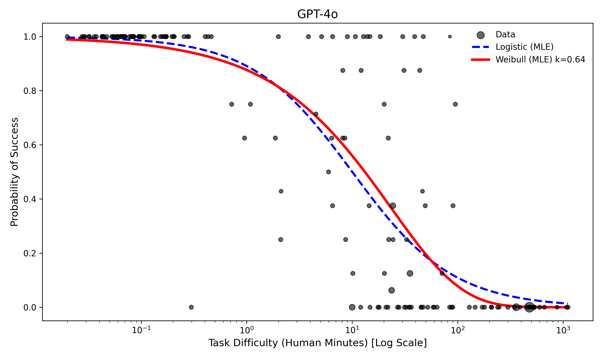
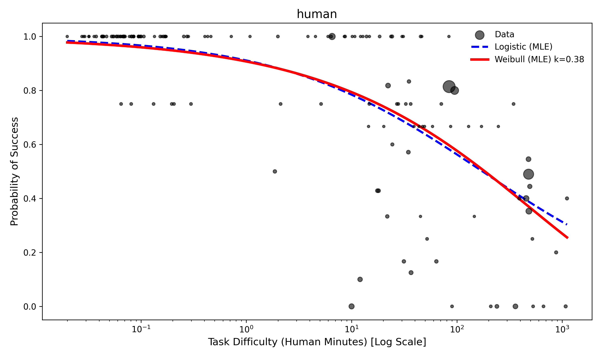

# Peto's Paradox and AI Agent Reliability

> **Companion repository** to the blog post: [Peto's Paradox and the Future of AI Agents](https://gushamilton.github.io/lab/2026/01/23/petos-paradox-ai-agents/)

This repository contains all code and data for analyzing METR's agentic task data using survival analysis methods. We compare logistic and Weibull models to understand how AI agent failure rates behave over time.

---

## Key Findings

### 1. All models show decreasing hazard over time (κ < 1)


The Weibull shape parameter κ is consistently below 1 for all tested models (and humans), suggesting a "Lindy effect"—models don't accumulate errors and fail more as tasks get longer. Instead, **hazard decreases over time**. This is encouraging for long-term agentic reliability.

---

### 2. Humans have fundamentally different reliability architecture


- **Humans**: κ ≈ 0.37 — if a human survives the first few minutes, they rarely fail later
- **Frontier AI models**: κ ≈ 0.6–0.9 — maintain a higher background rate of random failure

Critically, **model size correlates with lower λ (hazard rate) but NOT with lower κ**. Larger models fail less often, but don't seem to get intrinsically better at reducing hazard over time like humans do.

---

### 3. Weibull vs Logistic: Same median, divergent tails





Both models fit the median data almost identically (BIC is tied 7-7 across models). However, at extreme success probabilities:

| Success Rate | Horizon Ratio (Logistic/Weibull) |
|--------------|----------------------------------|
| 50%          | ~1x (identical)                  |
| 99.9%        | ~10x                             |
| 99.99%       | ~100x                            |

**The tails matter enormously** for real-world reliability requirements.

---

## Quick Start

```bash
# Clone with submodule (contains METR data)
git clone --recurse-submodules https://github.com/gushamilton/llm_weibull

# Install dependencies
pip install -r requirements.txt  # or use Poetry with eval-analysis-public

# Run the main analysis
python code/generate_model_fits.py
```

---

## Repository Structure

```
├── figures/              # Key figures from the blog post
├── code/                 # All analysis scripts
│   ├── generate_model_fits.py      # Main MLE fitting
│   ├── generate_final_figures.py   # Blog figure generation
│   ├── bootstrap_*.py              # Bootstrap CI calculations
│   └── bayesian_*.py               # Bayesian model comparison
├── results_mle/          # Analysis outputs
│   ├── model_fit_summary.csv
│   ├── weibull_params_with_bootstrap_ci.csv
│   └── additional/       # Extended analyses
├── docs/                 # Technical documentation
│   ├── key_results.md    # Detailed results walkthrough
│   └── peto_report.md    # Initial analysis report
└── eval-analysis-public/ # METR data (git submodule)
```

---

## Technical Details

### Models Compared

- **Logistic**: Standard S-curve fit (METR's approach)
- **Weibull**: Survival model with shape parameter κ controlling hazard evolution
- **Exponential**: Constant hazard baseline

### Key Outputs

| Output | Description |
|--------|-------------|
| `results_mle/model_fit_summary.csv` | BIC/AIC comparison across models |
| `results_mle/weibull_params_with_bootstrap_ci.csv` | κ and λ estimates with CIs |
| `results_mle/bayes_compare_kfold/` | K-fold cross-validation (most robust) |

See [`docs/key_results.md`](docs/key_results.md) for a complete walkthrough of all analyses.

---

## Configuration

Override paths via environment variables:

```bash
export PETO_DATA_FILE="path/to/all_runs.jsonl"
export PETO_RESULTS_ROOT="results_mle"
```

---

## Citation

If you use this analysis, please cite the blog post:

```
Hamilton, F. (2026). Peto's Paradox and the Future of AI Agents. 
https://gushamilton.github.io/lab/2026/01/23/petos-paradox-ai-agents/
```

## Acknowledgments

Data from [METR's eval-analysis-public](https://github.com/METR/eval-analysis-public). Thanks to METR for making this data freely available.
